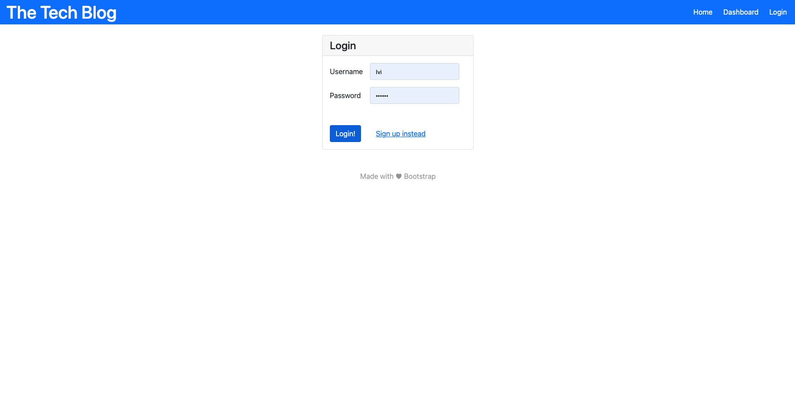

# Tech Blog

## License

  
   
  
  
## Technologies
         
   
  
  
  <h2>Table of Contents</h2>
  
  * [Technologies](#tech)
  * [Description](#description)
  * [Usage](#usage)
  * [Screenshots](#scrs)
  * [Link to the live view](#live)
  * [Questions](#questions)

## Description
[Main Menu](#home)

My task in this assignment was to build a CMS-style blog site similar to a Wordpress site, where developers can publish their blog posts and comment on other developers’ posts as well.

## Usage

[Main Menu](#home)
  
-Create the tech_blog_db schema using workbench (or your preferred method to perform this action). The schema file is available in the "db" folder; 
-Use the command line: "npm install" to install the dependencies; 
-To run the application, please run the command line: "npm start"; 
-On your web browser, please visit your localhost at: "http://localhost:3001" and, if needed, hit enter.  

 

## Screenshots 

<table>
  <tr>
    <td></td>
    <td></td>

  </tr>
  <tr>
    <td></td>
    <td></td>

  </tr>
  <tr>
    <td></td>
    <td></td>

  </tr>
  <tr>
    <td></td>
    <td></td>

  </tr>

  </table>
 
 

## Live view
[Main Menu](#home)

GitHub Repository-> <a href="https://ibarros19.github.io/tBlog/" target="_blank">LINK</a> 
 
Live view page-> <a href="https://" target="_blank">LINK</a> 

## Questions
[Main Menu](#home)

If you have any further questions, please feel free to contact me on GitHub at [ivibarros19](https://github.com/ivibarros19) or by email at [ivibarros19@gmail.com](ivibarros19@gmail.com).

